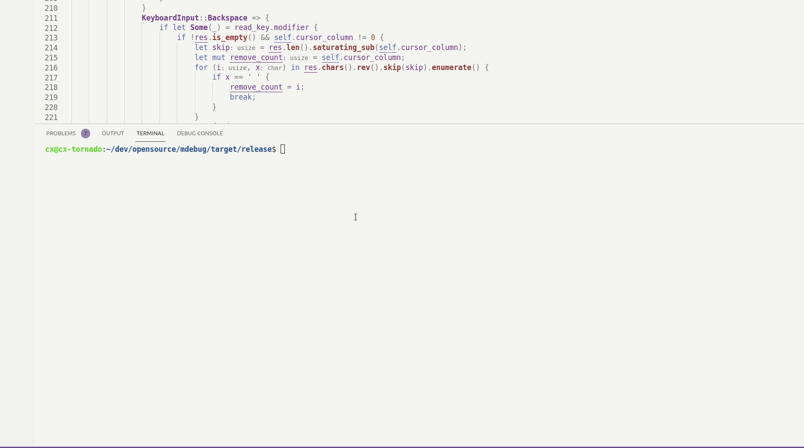

# Midas

Midas Debugger library for Rust / C / C++ with no dependencies. Perfect for learning.

## Workspace structure

The next section describes the layout of this workspace and what it contains.

## Libraries in this workspace

#### cli

Command line input library, that does some rudimentary stuff, that makes for a REPL like program. This library won't be exposed in any shape through the midas library. It's sole purpose for existing in this workspace, is to provide the CLI functionality for the "repl" variant of the debugger.

To test this library, there exists an example, in the examples folder of the cli library. To run / test, this ultra simple example, from bash/your shell of choice write, in the workspace root folder:

```bash
cargo run --example prompt
```

It has some simple features right now, like a history, moving the cursor like you would an normal repl (ctrl + key jumps over word boundaries etc). Up/down scrolls through input history. It has functionality for highlighting and coloring
although the example does not have it implemented right now.

#### linuxwrapper

Wrapping around the libc functionality we use. We could use an already existing library, but that would A; defeat the purpose of this project of learning the in's and outs of systems programming and B; add an incredibly unnecessary overhead, as we will not be using the entirety of libc, which other crates wrap around 1-to-1 thus, adding to binary size, compilation speed etc. We want full control when we can and we want it to be fast. But most importantly, I want to learn how the stuff works. Using crates is great, when we already know what needs to be done.

#### midas

The actual debugger library; the library which either the repl binary links to or the server, depending on what functionality the interface is meant to expose.

#### debug_info

## Binaries in this workspace

#### repl

The command line version of the debugger library. The functionality that this provides, as far as debugging goes, will be an exact 1-to-1 match with the server variant, what differs are the interfaces by which we communicate with the midas library. This idea was shamelessly stolen from headcrab.

For now, extremely, ridiculously few features are implemented, but the repl binary, can produce this;



#### server

An interface against Midas that instead of taking commands from the commandline, solely takes commands from a socket or some other form of IPC.

## Dependencies

Currently no dependencies, though, in the future, I _might_ pull in the rayon crate for multi threaded parallelism features. Or I might not. If I decide to write multi threaded code, it could be unsafe multi-threaded code, as I don't want to pollute neither the "inner" API's nor the "outwards" facing ones with Arc's etc. We _know_ we own the data, when we load the binary to parse it, we _know_ it's 100% immutable, there is absolutely 0 reason, to wrap it in Arc and mutexes. None. So in that case, we might just hand out raw pointers to the binary blob (the tracee) and offload whatever work we need. The only possible synchronization primitives / operations we need, is when we in turn retrieve the parsed data from that thread, but that's a much simpler problem to solve.

- libc
